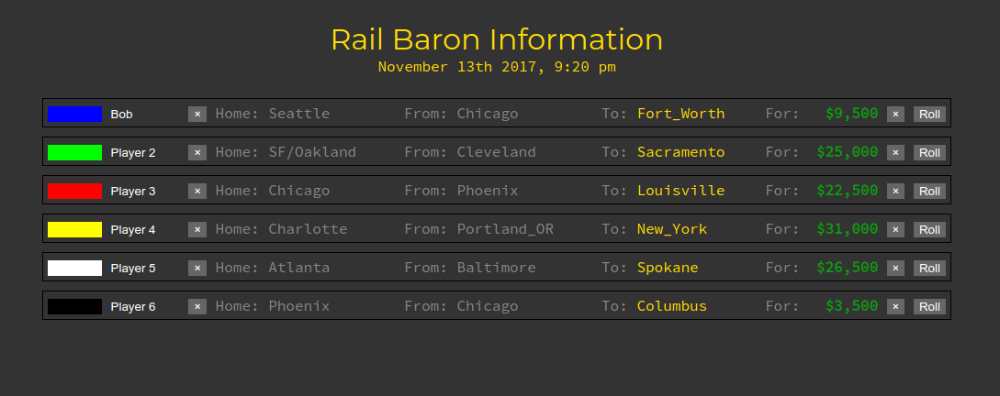

# Rail Baron Game Tracker

> A Vue.js project

## Build Setup

``` bash
# install dependencies
npm install

# serve with hot reload at localhost:8080
npm run dev

# build for production with minification
npm run build
```

For detailed explanation on how things work, consult the [docs for vue-loader](http://vuejs.github.io/vue-loader).

## Screenshot



Not quite finished yet :-)

### Todo

* [x] ~~Track player info in Vuex store~~
* [x] ~~Calculate destination payoffs~~
* [ ] Generate random destinations
